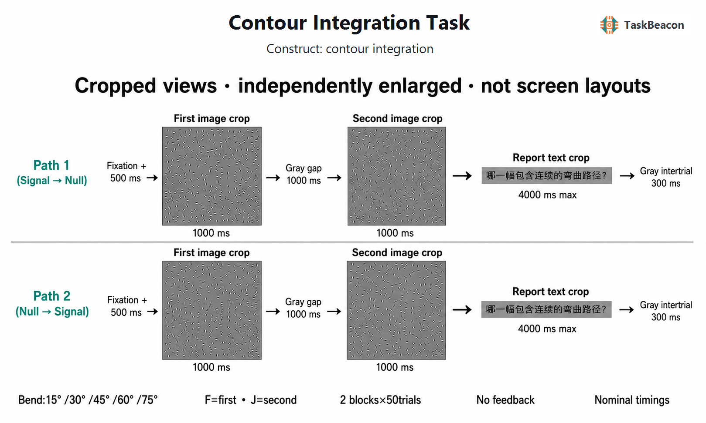

# Contour Integration Task

| Field | Value |
|---|---|
| ID | T000134 |
| Name | Contour Integration Task |
| Date Updated | 2026-08-31 |
| PsyFlow Version | 0.1.12 |
| PsychoPy Version | 2025.2.4 |
| Modality | behavior |
| Version | v0.1.0 · 2026-08-31 |
| Language | Chinese / SimHei |
| Framework | PsyFlow / TAPS v0.2.0 |

## 1. Task Overview

Detect a12-element jagged Gabor path within256elements using temporal two-alternative choice. Five bend magnitudes manipulate the cross-element integration demand. This is an uncalibrated pixel-based adaptation of Field, Hayes & Hess1993, not an exact replication, clinical test or threshold instrument. No human pilot, normative data, photometry or eye tracking has been performed.

Run `python main.py human`; validation modes are `python main.py qa`, `python main.py sim --config config/config_scripted_sim.yaml`, and the sampler config. Install PsyFlow, PsychoPy, pandas, NumPy and Pillow; use the shared TAPS validator. Default monitor dimensions are framework metadata, not measured physical calibration.

## 2. Task Flow

The figure uses independently enlarged participant-view crops, not whole-screen layouts. Actual native windows are1280×800pixels with a centered512×512array; web arrays are512CSSpixels square. The diagram is not a physical size or calibration reference.

### Block-Level Flow

Block-level flow: instructions → two blocks of50trials with a self-paced break → completion. Each of100unique pairs appears once. Native random.Random(seed+numeric subject ID) balances target interval within each bend, then shuffles item labels. BlockUnit owns execution. Diagnostic profiles use10trials spanning all five bends and both target intervals with unchanged timing.

### Trial-Level Flow

Trial-level flow: central fixation500ms → first array1000ms → gray gap1000ms → second array1000ms → response prompt up to4000ms → gray intertrial300ms. F chooses first and J second. Natural observation is allowed during images; no fixation invalidation is imposed. No feedback, reward or adaptive controller. RT starts at the response prompt, not image onset.

### Controller Logic

Other logic: corresponding arrays have identical element positions and identical global orientation multisets; the null globally permutes orientation assignments. The signal contains12ordered path elements. The generator rejects path crossings/duplicate cells and nulls retaining excessive planted alignment. These controls do not prove all possible visual cues absent; the finite bank needs empirical piloting before substantive research interpretation.

## 3. Configuration Summary

| Component | Setting |
|---|---|
| Subject | Integer 101–999; persisted only with locally collected data |
| Window | 1280×800, gray, pixel units; no silent image resizing |
| Stimuli | 512² grayscale;16² cells; sigma4px; carrier period8px; numerical amplitude.95 |
| Path | 12elements; bend15/30/45/60/75° with random sign and±10° perturbation |
| Timing | .5/1/1/1/≤4/.3seconds |
| Response | F first / J second; timeout retains missing row |
| Triggers | Software mock1/10/20/30/40/50/51/52/59/60/99 |
| Controller | None; no estimated threshold |

### a. Subject Info

Only numeric ID101–999 is requested. Synthetic validation uses134.

### b. Window Settings

See window table above. Pixel dimensions are not physical measurements.

### c. Stimuli

All signal/null stimuli are authored mathematical Gabors.

### d. Timing

All timing is configured in seconds; report ends on response.

One reduced row per logical trial records item/bend/target interval, displayed assets, phase fields, chosen interval, correctness and omission. Summary retains total, valid, missing, correct, accuracy_all and accuracy_valid denominators. Treat invalid or omitted responses as incorrect in accuracy_all; never silently drop them. Stage software timestamps do not certify physical display onset.

## 4. Methods (for academic publication)

The paradigm follows the temporal contour-detection structure of Field, Hayes & Hess (1993), [primary article](https://redwood.berkeley.edu/wp-content/uploads/2020/08/field-etal93.pdf). The supplied reference is [PubMed8447091](https://pubmed.ncbi.nlm.nih.gov/8447091/). Source-aligned parameters are the512² image,256circular Gabors, twelve path elements, Gaussian sigma4pixels, carrier period8pixels, five bend magnitudes and1second presentations. This implementation adapts count, response keys, ancillary timing, paired density/orientation controls and placement rejection. The source body±10° versus Fig5±5° discrepancy is documented; the body value is used. Geometric bend angles are not visual angles. Uncalibrated size/gamma, unsupervised viewing distance, no human pilot, no acuity screen and finite materials limit interpretation. Research should verify display timing, calibrate relevant display properties and pilot discriminability before estimating any psychometric function. Synthetic QA/simulation is software validation only.

Full audit and parameter/stimulus provenance are in `references/`; deterministic generator and manifest retain all material coordinates and hashes. Authored task code and stimuli are MIT licensed; source paper figures are not redistributed.
Reduced condition is the immutable item|target-interval plan label assigned by BlockUnit; bend_condition is the five-level factor for analysis. The separate bend_deg field supports numerical analyses.
Timing limitation: native capture uses round(nominal duration / estimated monitor frame period) frames and closes on the final flip. In recorded omissions, nominal4s reports closed at3.94878–4.05132s; the next intertrial flip was3.96570–4.06747s after report onset. The sampler run budget was238frames,237intervals; recorded59.9344fps predicts3.95432s, with observederror−5.55ms (<oneframe). Config equality therefore means equal nominal deadlines, not exact measured cross-platform windows. See validation/native_frame_budget.json and check_frame_budget.py. Do not pool boundary RTs assuming an exact4.000s physical deadline.
